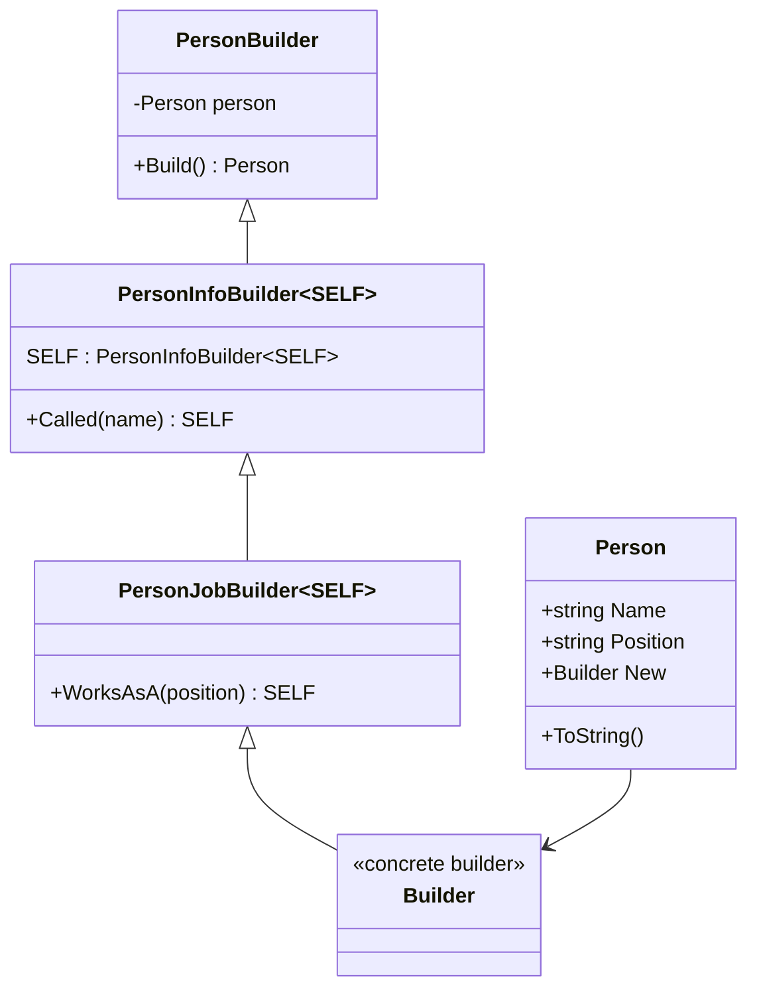

# Design-Patterns-CSharp

## <u>SOLID </u>

### Single Responsibility Principle

* A class should only have one reason to change
* Seperation of concerns - different classes handling different, independent task/problems

#### Example:
The Journal class should just handle adding and removing entries but not persistence.
[Journal.cs](SOLID/SingleResponsibility/Journal.cs)

Instead you should create a separate class to handle persistence.
[Persistence.cs](SOLID/SingleResponsibility/Persistence.cs)

---
### Open-Closed Principle

* Classes should be open for extension but closed for modification

#### Example:
The ProductFilter class has to be opened every time a new filter is added.
[ProductFilter.cs](SOLID/OpenClosed/Bad/ProductFilter.cs)

Instead use inheritance like in the specification pattern which will be covered in more detail later.

Create two generic interfaces, one for filters ([IFilter.cs](SOLID/OpenClosed/IFilter.cs)) and one for
specifications ([ISpecification.cs](SOLID/OpenClosed/ISpecification.cs)).  The filter interface has one
function called Filter that takes an IEnumerable of the generic type and ISpecification which has
one function called IsSatisfied which takes an instance of the generic type to be compared and returns
whether or not the specification is satisfied on that instance (in other words a predicate).

To use, make a concreate specification, in this case with the Product class
(example: [ColorSpecification.cs](SOLID/OpenClosed/ColorSpecification.cs)).  The concrete class should
take in all the properties to be filtered on (in this case Color).  In the implementation of IsSatisfied
just compare the passed in Product with the Color passed into ColorSpecification and return whether or
not the color matches.

Now create a concrete filter for the type being filtered, Product in this case
([BetterProductFilter.cs](SOLID/OpenClosed/BetterProductFilter.cs)).  The Filter function implementation
takes the IEnumerable of Products and an instance of a Product Specification (passing in the filter
criteria of the specification).  It returns a filtered IEnumerable that only contains items that satisfy
the satisfies the Specification (by calling IsSatisfied).

When creating an instance of BetterProductFilter pass in the IEnumerable of Products and the Specification
that you want to be satisfied.  Now you can add additional specifications without opening an existing class.

> [!NOTE] You can combine specifications by creating an and specification
([AndSpecification.cs](SOLID/OpenClosed/AndSpecification.cs)) and an or specification
([OrSpecification.cs](SOLID/OpenClosed/OrSpecification.cs)).

---
### Liskov Substitution Principle

* Objects of a derived type should be substitutable anywhere the base type is expected without breaking
program correctness.

Polymorphism allows different types to be treated as the same base type while still executing their own
behavior. This means code written for a base type should continue to work correctly when given any of its
subtypes.

#### Example:

In the `Rectangle`/`Square` example, `Square` attempts to modify the behavior of `Rectangle` by forcing
the width and height to always be equal.

In [BadSquare.cs](SOLID/LiskovSubstitution/Bad/BadSquare.cs), the `Width` and `Height` properties hide
the corresponding properties in [Rectangle.cs](SOLID/LiskovSubstitution/Rectangle.cs) using the `new`
keyword.

Because `new` hides the base class members instead of overriding them, polymorphism is broken. When a
`BadSquare` instance is referenced as a `Rectangle`, the base class properties are used instead of the
derived ones. This causes the object's behavior to depend on the **reference type** rather than the
**actual object type**.

The correct approach is shown in [Square.cs](SOLID/LiskovSubstitution/Square.cs), where `override`
is used instead of `new`. This preserves polymorphic behavior and ensures that the derived type
behaves consistently when used through a base class reference.

---
### Interface Segregation Principle

* Don't put too much into an interface; split into separate interfaces
* YAGNI - You Ain't Going to Need It

#### Example:

[IMachine.cs](SOLID/InterfaceSegregation/Bad/IMachine.cs) has `Print`, `Scan`, and `Fax` functions but
a regular printer may just want to implement the `Print` function, forcing you to implement useless
functions ([Printer.cs](SOLID/InterfaceSegregation/Bad/Printer.cs)).

Instead split them up into multiple interfaces ([IPrinter.cs](SOLID/InterfaceSegregation/IPrinter.cs), 
[IFaxer.cs](SOLID/InterfaceSegregation/IFaxer.cs), [IScanner.cs](SOLID/InterfaceSegregation/IScanner.cs)).
Now if you have a PhotoCopier you can implement IPrinter and IScanner and not be forced to implement
IFaxer ([PhotoCopier.cs](SOLID/InterfaceSegregation/Photocopier.cs)).

> [!NOTE] You can still define an interface that combines the other interfaces using composition 
([IMultiFunctionDevice.cs](SOLID/InterfaceSegregation/IMultiFunctionDevice.cs)).

---
### Dependency Inversion Principle

* High-level modules should not depend on low-level modules. Both should depend on abstractions.

#### Example

The high-level class [Research.cs](SOLID/DependencyInversion/Research.cs) should not access the low-level
storage implementation in [Relationships.cs](SOLID/DependencyInversion/Relationships.cs), such as the
`_relations` collection. If it did, the `Research` class would become tightly coupled to the internal
storage structure of `Relationships`.

This would mean that changing how relationships are stored (for example, switching from a list to a
database or graph structure) would require modifying the high-level `Research` code.

Instead, an abstraction is introduced with
[IRelationshipBrowser.cs](SOLID/DependencyInversion/IRelationshipBrowser.cs).

The low-level module `Relationships` implements this interface, while the high-level module `Research`
depends only on the abstraction. This allows the internal implementation of `Relationships` to change
without affecting the `Research` class.

***
## <u>Creational Design Patterns</u>

### Builder

* Some objects are simple and can be created in a single constructor call. Other objects require a lot of
ceremony to create.
* Having an object with 10 constructor arguments is not productive. Instead, opt for piecewise construction.
* Builder provides an API for constructing an object step-by-step.

#### Example:

[HtmlElement.cs](Creational/Builder/HtmlElement.cs) contains a list of child `HtmlElement`s.  
Instead of populating this list directly through a constructor or internal methods, a separate
builder class is used: [HtmlBuilder.cs](Creational/Builder/HtmlBuilder.cs).

`HtmlBuilder` creates an instance of `HtmlElement` and exposes an `AddChild` method that constructs
a new `HtmlElement` and adds it to the root element's child list.

> [!NOTE] `AddChild` returns the builder itself, allowing method calls to be chained. 
This pattern is known as a **Fluent Builder**.

#### <u>Fluent Builder Inheritance</u>

* To support fluent builders that use **inheritance**, recursive generics are required.

#### Example:

[Person.cs](Creational/Builder/FluentBuilderInheritance/Person.cs) defines a `Person` with two fields:
`Name` and `Position`. The builder is split into multiple classes so that different parts of the object
can be constructed by different builders. For example:

- [PersonInfoBuilder.cs](Creational/Builder/FluentBuilderInheritance/PersonInfoBuilder.cs) sets the `Name`
- [PersonJobBuilder.cs](Creational/Builder/FluentBuilderInheritance/PersonJobBuilder.cs) (which inherits
from `PersonInfoBuilder`) sets the `Position`

Recursive generics ensure that each builder method returns the **most derived builder type** rather
than a base builder type. This allows fluent chaining to continue across inherited builders without
losing access to derived builder methods.

> [!NOTE] When the concrete builder is defined as:
>
>class Builder : PersonJobBuilder<Builder>
>
>the generic parameter resolves to:
>
>SELF = Builder
>
>This ensures fluent methods return the most derived builder type:
>
>Called()   → Builder  
WorksAsA() → Builder  
Build()    → Person

#### <u>Stepwise Builder</u>

* Force a specific build order using separate interfaces for the build steps.

#### Example:

Have a Car class ([Car.cs](Creational/Builder/StepwiseBuilder/Car.cs)) that uses a builder to set the
type of car and the wheel size.  The wheel size needs to contain validation for allowable sizes based
on the type of car. Therefore the type will have to be set before the wheel size.

This can be accomplished by using separate interfaces for the build steps
([ISpecifyCarType.cs](Creational/Builder/StepwiseBuilder/ISpecifyCarType.cs),
[ISpecifyWheelSize.cs](Creational/Builder/StepwiseBuilder/ISpecifyWheelSize.cs)) and then having a base
build interface ([IBuildCar.cs](Creational/Builder/StepwiseBuilder/IBuildCar.cs)) that has a Build
function definition. The concrete builder then can contain a private field that implements all the interfaces
and dictates the order that the build implementation steps can be called due to the return types of each
build step ([CarBuilder.cs](Creational/Builder/StepwiseBuilder/CarBuilder.cs)).

#### <u>Functional Builder</u>

* Use extension methods rather than inheritance to extend builder functionality.

#### Example:

[PersonBuilder.cs](Creational/Builder/FunctionalBuilder/PersonBuilder.cs) is a sealed class and contains
a builder function to set the `Person`'s name but no builder function to set the occupation. That function
can be implemented in a static extension class
([PersonBuilderExtensions.cs](Creational/Builder/FunctionalBuilder/PersonBuilderExtensions.cs)).

The extension method `WorksAs` adds additional fluent functionality to the builder without modifying the
`PersonBuilder` class. This follows the **Open/Closed Principle** — the builder is closed for modification
but open for extension.

`PersonBuilder` inherits from
[FunctionalBuilder.cs](Creational/Builder/FunctionalBuilder/FunctionalBuilder.cs), which provides the
core functionality for the functional builder pattern. Instead of mutating the object directly, the builder
records a sequence of functions that will be applied to the object when `Build()` is called.

`FunctionalBuilder<TSubject, TSelf>` provides a reusable base implementation for functional
builders. It separates the generic builder mechanics from the concrete builder implementation.

`TSubject` represents the type of object being constructed, while `TSelf` represents the
concrete builder type that inherits from `FunctionalBuilder`.

The class is declared with the following constraints:

Each builder method records an operation using `Do(Action<T>)`. Internally these actions are stored as
`Func<T, T>` transformations that modify the object and return it. When `Build()` is called, a new `Person`
is created and each stored function is applied in sequence to produce the final object.

#### <u>Faceted Builder</u>

* Split the construction of a complex object into multiple specialized builders (facets).

#### Example:

[Person.cs](Creational/Builder/FacetedBuilder/Person.cs) represents a `Person` object that contains
properties belonging to two logical groups: **address information** (`StreetAddress`, `Postcode`,
`City`) and **employment information** (`CompanyName`, `Position`, `AnnualIncome`). Rather than
placing all builder functionality in a single class, the **Faceted Builder** pattern divides the
construction of the object into separate builders that focus on different aspects of the object.

[PersonBuilder.cs](Creational/Builder/FacetedBuilder/PersonBuilder.cs) acts as the **facade builder**.
It creates the `Person` instance and exposes properties that return specialized builders:

* `Lives` → returns a `PersonAddressBuilder`
* `Works` → returns a `PersonJobBuilder`

Each of these builders receives the same `Person` instance, ensuring all facets operate on the
same object.

[PersonAddressBuilder.cs](Creational/Builder/FacetedBuilder/PersonAddressBuilder.cs) is responsible
for configuring the **address facet** of the `Person` object. It provides fluent methods such as:

* `At(string streetAddress)`
* `WithPostcode(string postcode)`
* `In(string city)`

These methods set the corresponding address properties and return the builder to support fluent
method chaining.

[PersonJobBuilder.cs](Creational/Builder/FacetedBuilder/PersonJobBuilder.cs) configures the
**employment facet** of the `Person` object. It provides builder methods such as:

* `At(string companyName)`
* `AsA(string position)`
* `Earning(int amount)`

Like the address builder, these methods modify the shared `Person` instance and return the builder
for continued chaining.

Both facet builders inherit from `PersonBuilder`, allowing them to access the shared `Person`
instance and enabling the builder to switch between facets during the construction process.
